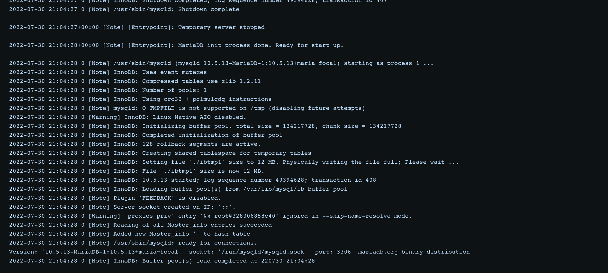

# How to download dev DB

1. Login to doctl registry using your non-expired access token:

`doctl registry -t <access_token> login`

2. Test if docker could be pulled by running:

`docker compose -f "docker-compose.test.yaml" up -d --build`

After while (2-3 minutes) database should be running. Check if you can login using credentials:

```bash
HOST: 127.0.0.1
USERNAME: demo
PASSWORD: demo
DATABASE: demo
```

<p align="center">
  
</p>

3. Define database image in your docker compose:

```yaml
version: "3.9"

services:
  db:
    image: $(echo $REGISTRY)/$(echo $IMAGE_NAME):latest
    ports:
      - 3306:3306
    restart: unless-stopped
```

## Optional

1. Download docker credentials:

2. Create docker config using downloaded credentials:

`docker config create <config-name-of-your-choice> ./docker-config.json`
